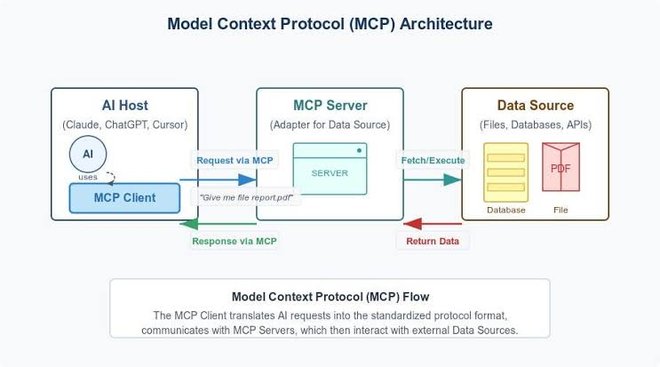

# MCP Sales Order Server

This TypeScript MCP server exposes two tools for SAP Sales Order operations using the `API_SALES_ORDER_SRV` OData v2 service.

## Available tools

- `read_sales_order`
  - Retrieve a specific sales order by ID or list sales orders with optional `$filter`, `$top`, and `$skip`.
- `create_sales_order`
  - Create a new sales order header and deep insert line items using the `to_Item` navigation property.

## Setup

1. Copy the example environment file:

```bash
cp .env
```

2. Install dependencies:

```bash
npm install
```

3. Start the MCP server:

```bash
npm run start:mcp
```

## Environment variables

- `SAP_API_URL` - Full base URL of the SAP OData service (without trailing slash)
- 'SAP_API_KEY' - API key from BusinessHub to access sandbox system

## Development

- `npm run build` - compile the TypeScript sources
- `npm run start:mcp` - run the MCP server with `ts-node`

## Architecture Overview
The system is split into three core layers: your desktop AI client, an intermediate bridging server running securely on SAP Business Technology Platform (BTP), and your main SAP backend data source.



1. Claude Desktop App (The AI Client): Reads a local configuration file on your machine. When you ask it a sales order question, it uses standard inputs/outputs to securely query the bridge server.

2. SAP CAP MCP Server (The Bridge): Runs on SAP BTP Cloud Foundry. It exposes a secure POST /mcp/call API endpoint via server.js that catches commands from the AI.

3. SAP Cloud OData Client SDK: Found inside the core application files, it translates the AI's requests into official SAP-compliant language to safely process data over your secure SAP_API_URL.

## Linking Claude to the Server
To point your desktop client to your BTP deployment, add the server setup details to your local Claude configuration profile.

File Path (Windows): %APPDATA%\Claude\claude_desktop_config.json

File Path (Mac): ~/Library/Application Support/Claude/claude_desktop_config.json

Open or create the file and append your connection arguments:

"mcpServers": {
    "sap-sales-order-mcp": {
      "command": "node",
      "args": [
        "C:\\<path>\\sales-mcp-stdio.js"
      ]
    }